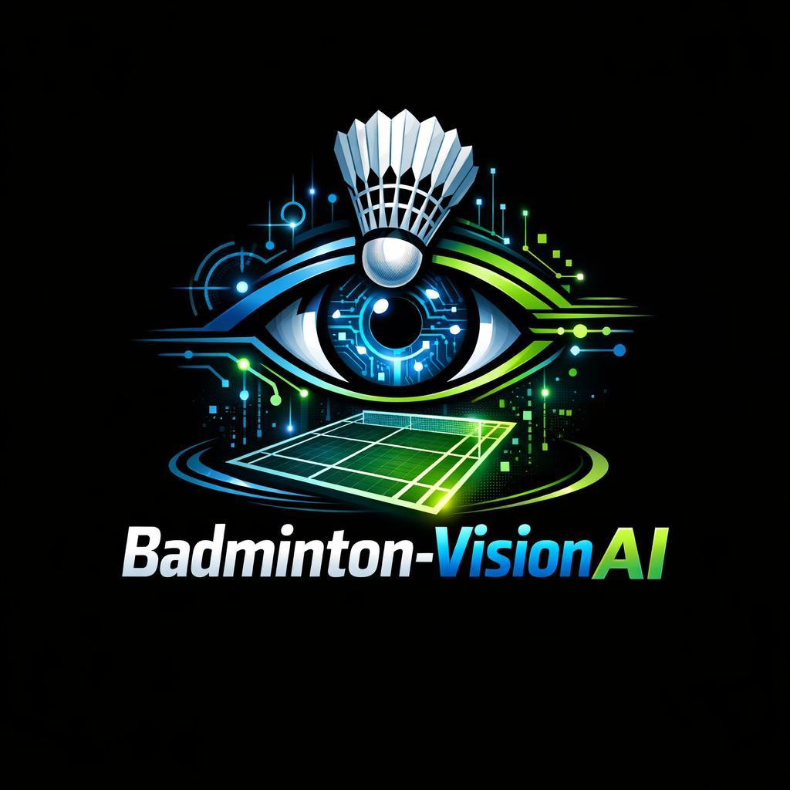

# 𝘽𝙖𝙙𝙢𝙞𝙣𝙩𝙤𝙣-𝙑𝙞𝙨𝙞𝙤𝙣𝘼𝙄
#### AI-Powered Badminton Performance Analysis System

  

**Real-time computer vision analytics for badminton**

Player & shuttlecock tracking • Mini-court projection • Shot type & power analysis • Streamlit dashboards

---

## Overview

**Badminton-VisionAI** is an AI-powered system for badminton performance analysis built on modern computer vision techniques. It enables **real-time player and shuttlecock tracking**, **homography-based mini-court projection**, **shot type and power analysis**, and **interactive performance visualization** through a Streamlit dashboard.
